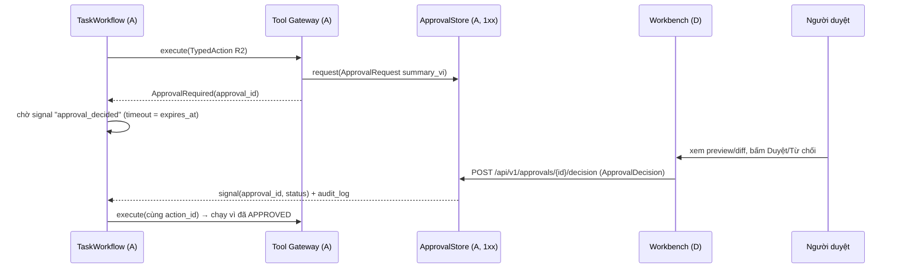
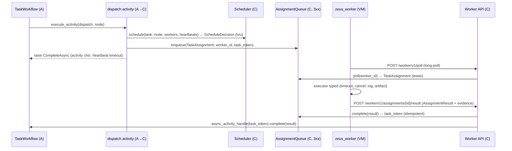

# ZeusVN Brain — Master Architecture (ZEUS Intelligence OS)

| Thuộc tính | Giá trị |
|---|---|
| Version | **1.0 — ARCHITECTURE LOCK** |
| Ngày | 2026-10-04 |
| Trạng thái | Đã khoá cho Phase 1. Thay đổi = ADR mới trong `docs/state/DECISION_LEDGER.md` |
| Contracts | `zeus/contracts` — `CONTRACTS_VERSION = "1.0.0"` (FROZEN) |
| Metric chính | **COST PER VERIFIED SUCCESS** (USD / task có `Outcome.VERIFIED_SUCCESS`) |
| Nguyên tắc | Claims are not evidence. Execution is not completion. Cloud là xưởng, không phải nền móng. |

---

## 0. Phạm vi và nguyên tắc nền

ZeusVN Brain là hệ điều hành điều phối–kiểm soát–học tập trung tâm của shop ZEUS VN: nhận sự kiện từ kênh
(Zalo, Messenger, Shopee, Workbench, ERP), hiểu ý định, đánh giá rủi ro, lập kế hoạch, chọn model/worker,
thực thi qua typed tool có kiểm soát, thu bằng chứng, kết luận outcome đã kiểm chứng, và học từ outcome đó.

Nguyên tắc bắt buộc (áp dụng cho mọi mục bên dưới):

1. **Verified outcome là đơn vị sự thật.** `EvidenceRecord.final_outcome = VERIFIED_SUCCESS` chỉ hợp lệ khi có
   bằng chứng mạnh (test/build/so khớp dữ liệu/HTTP check/xác nhận của người) — validator trong contract chặn.
2. **Mọi side-effect qua Typed Tool Gateway.** Không model nào gọi API ghi trực tiếp. R2/R3 cần approval của người.
3. **Nội dung từ kênh ngoài là dữ liệu, không phải lệnh** (`Event.untrusted = True` mặc định).
4. **Không runtime dependency vào Claude Cloud / claude.ai / Claude Code Routines / Remote Control.**
   Runtime dùng API key (Anthropic Console, OpenAI API, Gemini API) hoặc model local. Gói thuê bao chỉ dùng cho bàn làm việc của người.
5. **Chạy được khi không có GPU và khi không có cloud** (fallback hoặc xếp hàng, không mất việc).
6. **Thay đổi host ERP production = HUMAN DECISION GATE** (HIGH PRODUCTION RISK).
7. **Kiểm chéo:** bên soát khác hãng bên làm, đúng 1 vòng; kiểm tra chính là test/build/so khớp dữ liệu.
8. **Che PII trước khi gửi cloud** (Luật BVDLCN 91/2025/QH15, hiệu lực 01/01/2026); tenant phải opt-in cloud.

Ký hiệu sở hữu: **A** Control Plane · **B** Project Brain & Learning · **C** Execution Workers · **D** Workbench & Integrations · **shared** (chỉ Phase 0/integrator).

---

## 1. Luồng end-to-end

```mermaid
flowchart LR
  subgraph Ingress["D: kênh / Workbench"]
    ZB[Zalo Bot webhook] --> GW
    ZO[Zalo OA webhook] --> GW
    MS[Messenger webhook] --> GW
    SP[Shopee push] --> GW
    WB[Workbench lệnh] --> GW
  end
  GW["A: Event Gateway<br/>verify chữ ký → dedupe → Event(untrusted)"] --> IE[A: Intent Engine]
  IE --> RE[A: Risk Engine<br/>R0..R3, PII, injection]
  RE --> WF["A: Temporal TaskWorkflow"]
  WF --> BR["B: Brain Retrieval<br/>ContextPacket"]
  BR --> PL[A: Planner → TaskGraph DAG]
  PL --> CR[A: Critic khác hãng, 1 vòng]
  CR --> MB["A: Model Broker<br/>RouteDecision + fallback"]
  MB -->|Anthropic SDK / OpenAI-compatible| PRV[(Claude · GPT · Gemini · local 3060)]
  CR --> TG["A: Typed Tool Gateway<br/>schema → policy → approval"]
  TG -->|R2/R3| AP[D: Workbench duyệt]
  TG --> SC["C: Resource Scheduler<br/>ScheduleDecision(features)"]
  SC --> AQ["C: AssignmentQueue + Worker API"]
  AQ --> TW["C: thin worker VM<br/>zeus_worker executors"]
  TW -->|AssignmentResult + evidence| AQ
  AQ -->|async activity completion| WF
  WF --> EV["B: Evidence Engine<br/>EvidenceRecord"]
  EV --> JD[A: Judge khác hãng → Verdict]
  JD --> LP["B: Learning Plane<br/>Dataset RAW→CURATED, RouterStat"]
  LP -->|learned priors| MB
  LP -->|P(success|task,worker,state)| SC
  JD --> OUT[D: phản hồi khách qua typed action + Workbench]
```

Dạng text (đường đi một sự kiện):
`webhook → verify → Event(untrusted) → Intent → RiskAssessment → TaskWorkflow(Temporal) → ContextPacket →
Plan(TaskGraph) → Critique → [ApprovalRequest nếu R2+] → ScheduleDecision → TaskAssignment → worker thực thi →
AssignmentResult → EvidenceRecord → Verdict → DatasetRecord + RouterStat → router/scheduler học → phản hồi`.

---

## 2. Bản đồ thành phần → sở hữu → contract

| # | Thành phần | Sở hữu | Contract chính (`zeus/contracts`) |
|---|---|---|---|
| 1 | Event Gateway | A (+D adapter) | `Event`, `EventIngestRequest/Response`, `ChannelAdapter` |
| 2 | Intent Engine | A | `IntentEngine`, `Intent`, `TaskFamily` |
| 3 | Risk Engine | A | `RiskEngine`, `RiskAssessment`, `RiskLevel` |
| 4 | Project Brain Retrieval | B | `BrainRetriever`, `RetrievalQuery/Hit`, `ContextPacket` |
| 5 | Model Broker | A | `ModelBroker`, `ModelProvider`, `ModelRequest/Response`, `RouteDecision` |
| 6 | Planner | A | `Planner`, `Plan`, `TaskGraph` |
| 7 | Critic | A | `Critic`, `Critique` |
| 8 | Judge | A | `Judge`, `Verdict` |
| 9 | Task Graph/DAG | A | `TaskGraph`, `TaskNode` |
| 10 | Temporal workflows | A (+C dispatch) | `TASK_QUEUE_*`, `TaskAssignment`, `AssignmentQueue` |
| 11 | Worker Registry | C | `WorkerRegistry`, `WorkerInfo`, `WorkerHeartbeat`, `Inventory` |
| 12 | Resource Scheduler | C | `Scheduler`, `ScheduleFeatures`, `ScheduleDecision` |
| 13 | Typed Tool Gateway | A | `ToolGateway`, `ToolProvider`, `ActionSpec`, `TypedAction`, `ActionResult` |
| 14 | Policy Engine | A | `PolicyEngine`, `PolicyDecision`, `ApprovalStore` |
| 15 | Evidence Engine | B | `EvidenceStore`, `EvidenceRecord`, `EvidenceItem`, `TestRun` |
| 16 | Learning Plane | B | `OutcomeRecorder`, `DatasetRecord`, `RouterStat` |
| 17 | Evaluation Engine | B | `DatasetRecord`, `EVAL_TASK_FAMILIES`, `Verdict` |
| 18 | Champion/Challenger | B (+A tiêu thụ) | `RouteDecision.strategy`, `RouterStat` |
| 19 | Workbench | D | `WorkbenchDataSource`, `Paths.WORKBENCH`, Control API |
| 20 | Observability | shared | `zeus.obs` (`TraceContext`, `Span`), bảng `trace_spans` |
| 21 | Tenant Isolation | shared | `TenantId`, bảng `tenants` |
| 22 | Backup/Recovery | B (DB) + C (VM) | `EvidenceItem(kind=data_match)` cho restore test |
| 23 | Cloud Exit | shared | `Settings.claude_cloud_available`, `scripts/cloud_exit_check.sh` |
| 24 | Server Engineer lane | C | `ActionSpec(owner="C")`, `WorkerInfo(network_zone="ops")` |
| 25 | ERP boundary | D (+A policy) | `ToolProvider` Odoo JSON-2 |
| 26 | SaaS/website boundary | D | `ToolProvider`, `TaskFamily.WEBSITE_*`, `DOMAIN_PROVISIONING` |
| 27 | Channel boundary | D | `ChannelAdapter`, `Channel`, outbound `ActionSpec` |
| 28 | Local AI/GPU runtime | C (+A adapter) | `ProviderCapability(local=True)`, `EmbeddingProvider` |
| 29 | Security / prompt-injection | A (+all) | `Event.untrusted`, `ChatMessage.untrusted`, `RiskAssessment.injection_suspected` |
| 30 | Lifecycle/rollback/convergence | A (+B, C) | `ActionSpec.rollback_action`, `TaskStatus.ROLLED_BACK`, `EvidenceRecord.rollback_*` |

---

## 3. Đặc tả 30 thành phần

Mỗi mục: **Mục đích · Vào/Ra · Sở hữu · Phase 1 (làm ngay) · Phase sau · Nghiệm thu (bằng chứng)**.

### 3.1 Event Gateway
- **Mục đích:** cửa vào duy nhất cho mọi sự kiện; xác thực nguồn, chống trùng, chuẩn hoá, gắn trace, khởi chạy workflow.
- **Vào:** HTTP webhook (`Paths.HOOK_*`) hoặc `EventIngestRequest` (`POST /api/v1/events`). **Ra:** `Event(stage=NORMALIZED, untrusted=True, signature_verified=True)`, `EventIngestResponse`, start `TaskWorkflow`.
- **Sở hữu:** A (`zeus/gateway`); verify/normalize theo kênh là D (`ChannelAdapter`).
- **Phase 1:** route webhook → adapter.verify → normalize → dedupe theo `Event.dedupe_key()` (unique index 1xx) → lưu RAW payload ref → start workflow id = `evt-<dedupe_key hash>` (Temporal chống trùng lần 2). Trả 200 nhanh (< 1s), xử lý bất đồng bộ.
- **Phase sau:** rate-limit theo tenant/kênh, replay từ RAW store, NATS chỉ khi có bằng chứng cần fan-out pub/sub (ADR-002).
- **Nghiệm thu:** test chữ ký sai → 401 và không tạo Event; gửi trùng 2 lần → 1 workflow; trace_id xuyên suốt log/span.

### 3.2 Intent Engine
- **Mục đích:** phân loại `Event` thành `Intent(family, entities, confidence)`.
- **Vào:** `Event`. **Ra:** `Intent` (`TaskFamily` 18 + `general`).
- **Sở hữu:** A (`zeus/intent`).
- **Phase 1:** rules + local model (NERVOUS_SYSTEM) qua Broker; confidence < ngưỡng → `needs_clarification` → hỏi lại khách/đưa người.
- **Phase sau:** học từ verified outcome (confusion matrix trong eval), few-shot từ CURATED dataset.
- **Nghiệm thu:** eval corpus `evals/datasets/intent/*` (B) đạt accuracy ≥ ngưỡng trong `config/policy.yaml`; chạy được khi tắt cloud.

### 3.3 Risk Engine
- **Mục đích:** gán `RiskLevel` R0–R3, phát hiện PII và dấu hiệu prompt injection.
- **Vào:** `Event`, `Intent`; `TypedAction` + `ActionSpec`. **Ra:** `RiskAssessment`.
- **Sở hữu:** A (`zeus/risk`).
- **Phase 1:** bảng rủi ro deterministic theo family/action (R0 đọc · R1 ghi nội bộ · R2 ghi dữ liệu thật/production · R3 tiền/xoá/secret/ra ngoài); regex PII VN (SĐT, CCCD, email, địa chỉ); `external=True` ⇒ tối thiểu R2.
- **Phase sau:** classifier local cho PII/injection; risk theo lịch sử tenant.
- **Nghiệm thu:** test bảng quyết định (mọi `ActionSpec` có risk); không action R2+ nào chạy không approval (test gateway).

### 3.4 Project Brain Retrieval
- **Mục đích:** đưa đúng tri thức đã kiểm chứng vào ngữ cảnh với ngân sách token.
- **Vào:** `RetrievalQuery`. **Ra:** `list[RetrievalHit]`, `ContextPacket` (có `conflicts`, `token_estimate`).
- **Sở hữu:** B (`zeus/brain`).
- **Phase 1:** Postgres FTS + pgvector (hybrid), lọc tenant/trust/thời điểm hiệu lực, context budgeter, conflict resolver (ưu tiên `canonical_state` > `decision` > verified > mới hơn), embedding qua `EmbeddingProvider` local (fallback: lexical-only).
- **Phase sau:** reranker local, compactor, retention theo luật, graph quan hệ.
- **Nghiệm thu:** eval retrieval recall@k trên corpus; không bao giờ trả item khác tenant (test); chạy khi không có GPU.

### 3.5 Provider-neutral Model Broker
- **Mục đích:** một API gọi model cho mọi hãng; định tuyến, fallback, đo chi phí, che PII.
- **Vào:** `ModelRequest`. **Ra:** `ModelResponse` (usage, cost, latency, `fallback_chain`), `RouteDecision`.
- **Sở hữu:** A (`zeus/broker`, `config/models.yaml`).
- **Phase 1:** `AnthropicProvider` (SDK chính thức `anthropic`), `OpenAICompatibleProvider` dùng chung cho OpenAI / Gemini (endpoint OpenAI-compatible) / llama.cpp local (`/v1/chat/completions`). Route = bootstrap prior (mục 7) + lọc capability/PII/budget; fallback khi `ProviderUnavailable`; hết lựa chọn → xếp hàng (Temporal retry có backoff). Tính `Cost` từ bảng giá trong config.
- **Phase sau:** route học (`RouteStrategy.LEARNED`) từ `RouterStat`, explore ε nhỏ cho R0/R1, Batch API (-50%) cho việc không gấp, prompt caching.
- **Nghiệm thu:** test fallback (provider chết → provider kế → local → queue); test PII không rời máy khi `contains_pii`/tenant không opt-in; marker `cloud_exit_model_fallback` PASS.

### 3.6 Planner
- **Mục đích:** biến `Task` + `ContextPacket` thành `Plan` có `TaskGraph` DAG hợp lệ, mỗi node có acceptance + capability.
- **Vào:** `Task`, `ContextPacket`. **Ra:** `Plan`.
- **Sở hữu:** A (`zeus/planning`).
- **Phase 1:** playbook theo family (versioned, lưu ở Brain) + model COMMAND; JSON output validate bằng pydantic; node có action phải tham chiếu `ActionSpec` tồn tại.
- **Phase sau:** chọn playbook theo champion/challenger.
- **Nghiệm thu:** 100% plan qua validator DAG; eval plan-quality trên corpus 18 family.

### 3.7 Critic
- **Mục đích:** phản biện plan trước khi thực thi tốn tiền/rủi ro.
- **Vào:** `Plan`, `ContextPacket`. **Ra:** `Critique(issues, approve)`.
- **Sở hữu:** A.
- **Phase 1:** chỉ chạy khi `TaskGraph.max_risk ≥ R1` hoặc chi phí dự kiến > ngưỡng; reviewer **khác hãng** planner (`reviewer_provider ≠ planner provider`); đúng 1 vòng; BLOCKER ⇒ trả về người.
- **Phase sau:** critic local cho R0 để giảm chi phí.
- **Nghiệm thu:** test bất biến khác hãng; đo % plan bị chặn và sau đó outcome.

### 3.8 Judge
- **Mục đích:** kết luận outcome dựa trên bằng chứng.
- **Vào:** `Task`, `Sequence[EvidenceRecord]`. **Ra:** `Verdict`.
- **Sở hữu:** A.
- **Phase 1:** deterministic trước (test exit code, data match, HTTP check); model-judge chỉ khi không đo được bằng máy và luôn khác hãng bên làm; không có bằng chứng mạnh ⇒ `UNVERIFIED`/`NEEDS_HUMAN`.
- **Phase sau:** calibration judge với nhãn người.
- **Nghiệm thu:** validator `Verdict` (PASS ⇒ VERIFIED_SUCCESS + evidence_ids); eval judge agreement với nhãn người.

### 3.9 Task Graph / DAG
- **Mục đích:** biểu diễn công việc nhiều bước, song song hoá an toàn.
- **Vào/Ra:** `TaskGraph(nodes: TaskNode[])`; `topological_order()`, `ready_nodes(done)`, `max_risk`.
- **Sở hữu:** A (`zeus/orchestration`). Contract shared (đã có validator chu trình/phụ thuộc thiếu/trùng id).
- **Phase 1:** TaskWorkflow duyệt DAG, chạy node sẵn sàng song song (giới hạn), retry theo `max_retries`.
- **Phase sau:** re-plan động khi node fail (tối đa 1 lần).
- **Nghiệm thu:** test DAG (đã có ở `tests/shared/test_contracts.py`); workflow test với DAG 4 node.

### 3.10 Temporal durable workflows
- **Mục đích:** xương sống bền vững: retry, timeout, chờ approval nhiều ngày, tiếp tục sau crash.
- **Vào/Ra:** workflow `TaskWorkflow(Task) -> Verdict`; task queues `zeus-control`, `zeus-brain`, `zeus-dispatch`; data converter `pydantic_data_converter`.
- **Sở hữu:** A (workflow + activity control); C (dispatch activity side + `AssignmentQueue`); B (activities brain/evidence).
- **Phase 1:** Temporal Server (CLI 1.5.1 / Server 1.29.1) trên `zeus-core` với persistence Postgres; approval = signal; dispatch tới worker = **async activity completion** với `task_token` (ADR-011); heartbeat activity.
- **Phase sau:** schedules thay cron, versioning workflow (patching) khi đổi logic.
- **Nghiệm thu:** smoke test `tests/shared/test_temporal_smoke.py` (PASS); test kill worker giữa chừng → workflow tiếp tục; marker `cloud_exit_workflow`.

### 3.11 Worker Registry
- **Mục đích:** biết worker nào sống, có gì, đang làm gì.
- **Vào:** `WorkerRegisterRequest`, `WorkerHeartbeat`. **Ra:** `WorkerInfo`, `HeartbeatResponse(drain, cancel_assignment_ids)`.
- **Sở hữu:** C (`zeus/workers`, Worker API router).
- **Phase 1:** đăng ký bằng token riêng mỗi worker (`X-Zeus-Worker-Token`), heartbeat 15s, `mark_stale` → OFFLINE, inventory (CPU/RAM/disk/GPU).
- **Phase sau:** mTLS, xoay token tự động.
- **Nghiệm thu:** test stale → OFFLINE → assignment được lập lịch lại; marker `cloud_exit_worker_control`.

### 3.12 Resource Scheduler
- **Mục đích:** chọn worker cho từng node; lưu đủ dữ liệu để học.
- **Vào:** `Task`, `TaskNode`, `WorkerInfo[]`, `WorkerHeartbeat{}`. **Ra:** `ScheduleDecision(features, weights, candidates, policy_version)`.
- **Sở hữu:** C.
- **Phase 1:** scorer tuyến tính deterministic trên 10 yếu tố `ScheduleFeatures`: CapabilityMatch, WorkerHealth, CPUAvailable, RAMAvailable, QueueLoad, HistoricalSuccess, DataLocality, Urgency, Risk, FailurePenalty. Ràng buộc cứng: capability, tenant scope, status, network zone. Không ai đủ ⇒ `worker_id=None` (xếp hàng).
- **Phase sau:** mô hình P(success | task, worker, state) học từ `ScheduleDecision.outcome`; chỉ thay scorer qua champion/challenger.
- **Nghiệm thu:** test deterministic (cùng input ⇒ cùng output); 100% decision có feature vector; join được decision ↔ outcome.

### 3.13 Typed Tool Gateway
- **Mục đích:** cửa duy nhất cho side-effect.
- **Vào:** `TypedAction` (+`Task`). **Ra:** `ActionResult` hoặc `PolicyDenied` / `ApprovalRequired(ApprovalRequest)`.
- **Sở hữu:** A (`zeus/policy`). `ToolProvider` do chủ tích hợp viết (D: ERP/kênh/domain; C: hạ tầng).
- **Phase 1:** đăng ký `ActionSpec` (tên `ns.object.verb`, JSON Schema, risk, external, reversible, rollback_action, idempotent, timeout); pipeline validate schema → tenant check → policy → approval → execute (local hoặc qua worker) → audit_log → evidence. Idempotency key bắt buộc với action external.
- **Phase sau:** dry-run/simulate cho R2, giới hạn tần suất theo action.
- **Nghiệm thu:** test action không đăng ký bị từ chối; R2 không approval không chạy; mỗi lần chạy có dòng `audit_log`.

### 3.14 Policy Engine
- **Mục đích:** luật deterministic về quyền, approval, ngân sách, cloud/PII.
- **Vào:** `TypedAction`, `ActionSpec`, `Task`. **Ra:** `PolicyDecision(effect, rule_ids, required_approvers, budget_remaining_usd, redact_pii, allow_cloud)`.
- **Sở hữu:** A (`zeus/policy`, `config/policy.yaml`).
- **Phase 1:** R0/R1 ALLOW (trong budget), R2 REQUIRE_APPROVAL(1), R3 REQUIRE_APPROVAL(1, chủ shop) + không bao giờ auto; budget tháng/ngày theo tenant; denylist.
- **Phase sau:** auto-approve R2 cho action đã có ≥ N verified success (chỉ qua ADR + gate G10).
- **Nghiệm thu:** test bảng luật; mọi `PolicyDecision` có `rule_ids` (truy vết được).

### 3.15 Evidence Engine
- **Mục đích:** ghi `EvidenceRecord` chuẩn cho mọi task — nguồn duy nhất cho metric và learning.
- **Vào:** `AssignmentResult`, `ActionResult`, `TestRun`, `EvidenceItem`, usage/cost. **Ra:** `EvidenceRecord` (append-only), artifact refs (`ArtifactRef` sha256).
- **Sở hữu:** B (`zeus/evidence`, migrations 2xx).
- **Phase 1:** lưu Postgres + artifact store (thư mục content-addressed trên `zeus-core`, sha256); bất biến "claims are not evidence" (validator); liên kết route_id, schedule_decision_id.
- **Phase sau:** ký số bản ghi, xuất báo cáo.
- **Nghiệm thu:** đủ trường (test contract); truy vết task → evidence → artifact; marker `cloud_exit_evidence`.

### 3.16 Learning Plane
- **Mục đích:** biến outcome thành tri thức có kiểm soát.
- **Vào:** `EvidenceRecord`. **Ra:** `DatasetRecord` (RAW → NORMALIZED → VERIFIED → CURATED), `RouterStat`, nhãn cho scheduler.
- **Sở hữu:** B (`zeus/learning`).
- **Phase 1:** outcome tracking, router stats theo (family, provider, model) với `cost_per_verified_success`, CURATED bắt buộc PII-redacted.
- **Phase sau:** fine-tune/LoRA local từ CURATED (chỉ khi số đo chứng minh lợi ích), playbook mining.
- **Nghiệm thu:** validator stage; báo cáo cost/verified success theo family khớp tổng cost của EvidenceRecord.

### 3.17 Evaluation Engine
- **Mục đích:** đo trước khi tin; chống thoái lui.
- **Vào:** `evals/datasets/<family>/*.jsonl` (`DatasetRecord`), candidate (model/prompt/playbook/scheduler). **Ra:** báo cáo eval (pass rate, cost, latency) + `Verdict` từng case.
- **Sở hữu:** B (`zeus/evals`, `evals/**`).
- **Phase 1:** runner offline, regression corpus ≥ 5 case/family cho 18 family, chạy được với fake/local.
- **Phase sau:** eval live có ngân sách (marker `live`), eval theo tenant.
- **Nghiệm thu:** `pytest -m "not live"` chạy eval với fake; report JSON lưu làm artifact.

### 3.18 Champion/Challenger
- **Mục đích:** thay đổi route/prompt/playbook/scheduler chỉ khi có số đo hơn.
- **Vào:** `RouterStat`, eval report. **Ra:** quyết định promote (ghi Decision Ledger tự động + Brain `decision`).
- **Sở hữu:** B (logic + thống kê), A (áp dụng vào broker/planner).
- **Phase 1:** shadow mode cho R0/R1 (challenger chạy song song, không side-effect); promote khi thắng với khoảng tin cậy và cost/verified success không tệ hơn.
- **Phase sau:** bandit có ràng buộc ngân sách.
- **Nghiệm thu:** promote nào cũng có eval report + ADR/ledger entry; R2+ promote qua gate G10.

### 3.19 Workbench
- **Mục đích:** bàn điều khiển tiếng Việt: task, duyệt approval, xem evidence, worker, chi phí.
- **Vào:** `WorkbenchDataSource`, Control API. **Ra:** `ApprovalDecision`, lệnh (Event kênh `workbench`).
- **Sở hữu:** D (`zeus/workbench`).
- **Phase 1:** FastAPI + Jinja2 + vanilla JS/CSS vendored (không build step, không CDN), mount `/wb`, chỉ nghe mạng nội bộ/VPN; trang: Hàng đợi duyệt, Task, Evidence, Worker, Chi phí.
- **Phase sau:** realtime (SSE), mobile layout.
- **Nghiệm thu:** test TestClient render trang khi không có mạng; duyệt approval → workflow nhận signal.

### 3.20 Observability
- **Mục đích:** mọi việc truy vết được theo trace_id/task_id/workflow_id/tenant_id.
- **Vào/Ra:** `zeus.obs` (`bind_trace`, `SpanRecorder`, `JsonFormatter`), bảng `trace_spans`, `audit_log`.
- **Sở hữu:** shared (kernel), mỗi workstream gắn span cho phần mình.
- **Phase 1:** JSON log + span vào Postgres (`PgSpanExporter`), semantic `gen_ai.*` cho lời gọi model, W3C `traceparent` qua HTTP.
- **Phase sau:** exporter OTel (extra `otel`) sang collector nếu cần.
- **Nghiệm thu:** test log JSON có đủ trường (PASS); span cha–con đúng (PASS); truy vấn 1 trace ra toàn bộ đường đi.

### 3.21 Tenant Isolation
- **Mục đích:** dữ liệu khách SaaS không lẫn nhau, không lẫn nội bộ.
- **Vào/Ra:** `TenantId` trong mọi contract; bảng `tenants(allow_cloud_llm)`.
- **Sở hữu:** shared (contract), từng workstream thực thi trong store của mình.
- **Phase 1:** mọi bảng nghiệp vụ có `tenant_id` NOT NULL FK `tenants`; mọi query lọc tenant; Tool Gateway chặn tenant mismatch; worker có `tenant_scope`.
- **Phase sau:** Postgres RLS theo `current_setting('zeus.tenant_id')`; khoá mã hoá theo tenant.
- **Nghiệm thu:** test chéo tenant ở mỗi store (retrieval, evidence, approvals, workbench) đều rỗng.

### 3.22 Backup/Recovery
- **Mục đích:** khôi phục được, đã chứng minh bằng restore thật.
- **Vào/Ra:** pg_dump/pgBackRest của Brain DB + Temporal DB; snapshot Incus/ZFS; bằng chứng `EvidenceItem(kind=data_match)` sau restore test.
- **Sở hữu:** B (DB Brain, retention), C (snapshot VM, đĩa E, offsite).
- **Phase 1:** dump đêm → đĩa E + 1 bản offsite mã hoá; restore test tuần vào DB tạm, so khớp số dòng/checksum ⇒ evidence.
- **Phase sau:** PITR (WAL archive), RPO ≤ 15 phút.
- **Nghiệm thu:** báo cáo restore test có evidence PASS; backup không chứa secret dạng rõ.

### 3.23 Cloud Exit
- **Mục đích:** chứng minh hệ thống không phụ thuộc Claude Cloud. Hợp đồng chi tiết ở mục 9.
- **Vào/Ra:** `CLAUDE_CLOUD_AVAILABLE=false`; `scripts/cloud_exit_check.sh` → bảng PASS/FAIL/NOT_YET.
- **Sở hữu:** shared; mỗi workstream bổ sung test marker hạng mục của mình.
- **Phase 1:** tất cả hạng mục PASS trước khi kết thúc Phase 1.
- **Nghiệm thu:** script exit 0 và không còn NOT_YET ở cuối Phase 1.

### 3.24 Server Engineer lane
- **Mục đích:** làn riêng cho việc hạ tầng (Incus, backup, monitoring, cập nhật) với kiểm soát chặt.
- **Vào/Ra:** `TypedAction` namespace `infra.*` (owner C) chạy trên worker `w-ops` (`network_zone="ops"`); output `ActionResult` + evidence (log, health check).
- **Sở hữu:** C.
- **Phase 1:** chỉ action R0 (đọc trạng thái: `infra.host.inspect`, `infra.backup.verify`) và R1 trên VM không-production; mọi thay đổi host ERP = R3 + gate G1; script luôn có `--chay-thu` (dry-run) xuất plan trước.
- **Phase sau:** runbook tự động hoá có rollback đã kiểm chứng.
- **Nghiệm thu:** không action nào của lane chạm host production khi chưa có ApprovalDecision; dry-run output lưu làm evidence.

### 3.25 ERP integration boundary (Odoo 19)
- **Mục đích:** đọc/ghi ERP an toàn, nguyên khối.
- **Vào/Ra:** `ToolProvider` Odoo: `erp.<model>.<method>` → `POST /json/2/<model>/<method>`, `Authorization: bearer <api key>`, header `X-Odoo-Database`; mỗi lời gọi là 1 transaction ⇒ chỉ gọi **phương thức nghiệp vụ nguyên khối** (vd `action_confirm`), không chuỗi write rời.
- **Sở hữu:** D (`zeus/integrations/odoo`); policy/risk A.
- **Phase 1:** user bot quyền tối thiểu, key trên `zeus-core` duy nhất; đọc = R0; ghi production = R2 (approval); phát triển/kiểm thử trên `erp-staging`.
- **Phase sau:** webhook/automation từ Odoo vào Event Gateway.
- **Nghiệm thu:** test hợp đồng với Odoo giả lập (HTTP mock); test staging thật (marker `live`); không có lời gọi ERP ngoài Tool Gateway (grep test).

### 3.26 SaaS / customer website boundary
- **Mục đích:** dựng/sửa website khách mà không đụng host ERP.
- **Vào/Ra:** `ToolProvider` `site.*`, `domain.*`; task family `website_edit/website_build/domain_provisioning/deployment`.
- **Sở hữu:** D (`zeus/integrations/saas`, `zeus/integrations/domain`).
- **Phase 1:** host web khách ở **VPS riêng** (không chung host ERP); build/test trên `w-code-*`, deploy là R2; tên miền .vn: khách tự eKYC (NĐ 147/2024); `domain.register` là R3, chỉ chạy sau khi xác nhận **đã thu tiền** (không hoàn được).
- **Phase sau:** template site đa tenant, tự động gia hạn có approval.
- **Nghiệm thu:** HTTP check site sau deploy = evidence; test policy chặn `domain.register` khi chưa có payment evidence.

### 3.27 Zalo / Facebook / Shopee channel boundary
- **Mục đích:** chỉ dùng kênh chính thức; nhận an toàn, gửi có kiểm soát.
- **Vào/Ra:** `ChannelAdapter.verify/normalize` → `Event`; outbound qua `ActionSpec` `channel.<kênh>.send_message` (R2 mặc định; template đã duyệt có thể R1 qua ADR).
- **Sở hữu:** D (`zeus/channels`).
- **Phase 1:** chính sách kênh ở mục 8; giới hạn 2000 ký tự Zalo Bot (cắt/chia an toàn); Messenger tự trả lời trong 24h, sau đó chỉ người (HUMAN_AGENT).
- **Phase sau:** Zalo OA GMF (gate G6), Shopee chat API (chỉ khi shop được whitelist).
- **Nghiệm thu:** test chữ ký từng kênh với vector chuẩn; test không có đường gửi tin nào bỏ qua Tool Gateway.

### 3.28 Local AI / GPU runtime
- **Mục đích:** NERVOUS SYSTEM rẻ, riêng tư, luôn có.
- **Vào/Ra:** llama.cpp server OpenAI-compatible (`/v1/chat/completions`, `/v1/embeddings`) trong container Incus `zeus-gpu` (`nvidia.runtime=true`, không passthrough VM); `ProviderCapability(local=True)`.
- **Sở hữu:** C (`zeus/localai`: cấu hình runtime, health, model inventory); adapter gọi là A (`OpenAICompatibleProvider`); embedding provider impl là B.
- **Phase 1:** 1 model thường trú **Qwen3.5-9B GGUF Q4_K_M** (~55 tok/s decode trên 3060, số đo cộng đồng — phải đo lại) + 1 embedding nhỏ + OCR; health check; hệ thống chạy khi GPU tắt (fallback cloud hoặc xếp hàng).
- **Phase sau:** 3090 chỉ khi số đo đòi model > 12GB (gate G9); reranker local.
- **Nghiệm thu:** benchmark tok/s + VRAM lưu làm evidence; test broker với local down → fallback.

### 3.29 Security / prompt-injection isolation
- **Mục đích:** nội dung không tin cậy không điều khiển được hệ thống.
- **Vào/Ra:** `Event.untrusted`, `ChatMessage.untrusted`, `MemoryItem.trust`, `RiskAssessment.injection_suspected`.
- **Sở hữu:** A (broker bọc dữ liệu untrusted, policy), D (kênh), B (trust trong Brain), C (cô lập mạng worker).
- **Phase 1:** (1) nội dung untrusted luôn bọc trong khối dữ liệu, không bao giờ ghép vào system prompt; (2) model không có tool trực tiếp — chỉ đề xuất `TypedAction`, gateway quyết; (3) worker không giữ API key provider/ERP; (4) secrets chỉ ở `zeus-core` (file 0600/systemd credentials), không trong git; (5) mạng: worker chỉ tới Worker API; ERP staging tách bridge; (6) PII redaction trước cloud.
- **Phase sau:** sandbox seccomp cho executor, quét secret tự động trong artifact.
- **Nghiệm thu:** corpus injection (B) — 0 action R2+ được tạo ra mà không approval; test redaction.

### 3.30 Lifecycle / rollback / convergence
- **Mục đích:** mọi việc kết thúc ở trạng thái xác định; lỗi thì quay về an toàn.
- **Vào/Ra:** `TaskStatus` (… `SUCCEEDED/FAILED/CANCELLED/ROLLED_BACK`), `ActionSpec.rollback_action/reversible`, `EvidenceRecord.rollback_performed/rollback_ref`, `TaskAssignment.lease_expires_at`.
- **Sở hữu:** A (saga trong workflow), C (lease/cancel/timeout ở worker), B (ghi evidence rollback).
- **Phase 1:** saga: action reversible có compensation chạy ngược khi node sau fail; action không reversible đặt cuối DAG và cần approval; lease hết hạn ⇒ assignment lập lịch lại (idempotency key); convergence = workflow luôn kết thúc với Verdict (kể cả `UNVERIFIED` + NEEDS_HUMAN).
- **Phase sau:** reconciliation job so trạng thái mong muốn với thực tế (ERP, site, worker).
- **Nghiệm thu:** test fault-injection: worker chết, provider chết, approval quá hạn ⇒ trạng thái cuối đúng và có evidence.

---

## 4. Topology host & 8 instance mục tiêu

Host: Ubuntu, i9-13900 **ES2 (Q0L4)** — 8 nhân P (CPU logic 0–15, SMT) + 16 nhân E (16–31); RAM 80GB DDR4;
RTX 3060 12GB; NVMe C 512GB, D 1TB, E 512GB. **ERP production đang chạy trên chính host này.**

Giả định (phải đo trước khi tạo VM — gate G2): ERP production (Odoo + PostgreSQL) chạy trực tiếp trên host,
dùng nhân P và ≤ 16GB RAM ở đỉnh; OS host nằm ở C. Nếu số đo khác, bảng dưới phải tính lại trước khi chạy.

| # | Instance | Loại | Vai trò | vCPU (ghim) | RAM | Đĩa (pool) | Mạng / bridge |
|---|---|---|---|---|---|---|---|
| 1 | `zeus-core` | VM | Control API, Event Gateway, Temporal Server, Postgres16+pgvector (Brain/Evidence/Temporal), Workbench, artifact store | 4 E (16–19) | 12 GB | 150 GB (D) | `br-core` 10.90.30.10 |
| 2 | `zeus-gpu` | Container (`nvidia.runtime`) | llama.cpp Qwen3.5-9B Q4_K_M + embedding + OCR | 2 P-thread (14–15) | 6 GB | 60 GB (D, model) | `br-core` 10.90.30.20 |
| 3 | `zeus-edge` | Container | Reverse proxy ingress chỉ `/hooks/*` (TLS), không có secret nghiệp vụ | dùng chung 28–29 (allowance 25%) | 1 GB | 10 GB (D) | `br-dmz` 10.90.50.10 + `br-core` |
| 4 | `w-code-1` | VM | thin worker: git, build, test, Python/Node, Odoo addon dev | 4 E (20–23) | 8 GB | 80 GB (D) | `br-agent` 10.90.10.21 |
| 5 | `w-code-2` | VM | thin worker thứ hai (song song/SaaS build) | 2 E (24–25) | 6 GB | 60 GB (D) | `br-agent` 10.90.10.22 |
| 6 | `w-browser` | VM | headless Chromium/Playwright: visual QA, kiểm tra site; noVNC chỉ để người quan sát | 2 E (26–27) | 6 GB | 40 GB (D) | `br-agent` 10.90.10.23 |
| 7 | `w-ops` | VM | Server Engineer lane: inspect, backup verify, monitoring (không có credential production mặc định) | 2 E (28–29) | 4 GB | 40 GB (D) | `br-ops` 10.90.40.10 |
| 8 | `erp-staging` | VM | Odoo 19 staging (dữ liệu đã làm sạch PII) cho dev/test ERP | 2 E (30–31) | 8 GB | 80 GB (D) | `br-erp-test` 10.90.20.11 |
| – | `w-gui-win` | VM (TẮT mặc định) | GUI fallback Windows chỉ khi bắt buộc (gate G8) | lấy từ `w-code-2` | 6 GB từ dự phòng | 80 GB | `br-agent` |

**Ngân sách RAM 80 GB:**

| Hạng mục | GB | Ghi chú |
|---|---|---|
| 8 instance ở trên | 51 | 12+6+1+8+6+6+4+8 |
| **Dự phòng ERP production trên host** | **16** | GIẢ ĐỊNH — đo đỉnh 7 ngày trước khi duyệt (G2) |
| OS host + Incus/QEMU overhead | 4 | |
| ZFS ARC (giới hạn) | 4 | `zfs_arc_max` = 4 GiB (thiết kế cũ 6) |
| Dự phòng an toàn (không cấp) | 5 | chống OOM ERP; `w-gui-win` chỉ dùng phần này khi G8 duyệt |
| **Tổng** | **80** | |

CPU: nhân P 0–13 dành cho host + ERP production; 14–15 cho `zeus-gpu`. Nhân E 16–31 ghim 1:1 cho VM.
Rủi ro CPU ES (G3): kiểm chữ ký CPU + microcode Vmin trên máy, đo nhiệt/điện áp nhân E dưới tải, theo dõi MCE/WHEA;
nếu bất ổn → hạ tải E hoặc không chạy workload quan trọng trên host này.

Đĩa: C = OS host (+ ERP production, cần xác nhận); D = pool Incus (VM, model); E = đích backup cục bộ + export snapshot; luôn có 1 bản offsite mã hoá.

Mạng (nftables, gate G1): `br-agent` → chỉ `zeus-core:8080/worker/v1/*` + internet (proxy egress tuỳ chọn);
`br-erp-test` ↔ chỉ `zeus-core` (adapter Odoo) và `w-code-*` qua cổng Odoo; `br-ops` → `zeus-core` + SSH host qua
jump có approval; `br-dmz` → chỉ `zeus-core:/hooks/*`; ERP production không mở cho bridge nào ngoài `zeus-core`
(chỉ JSON-2, user bot quyền tối thiểu).

---

## 5. Reconcile thiết kế cũ `infra/may-ao` → thin worker

| Thành phần cũ | Quyết định | Thay bằng / lý do |
|---|---|---|
| Incus + KVM, profile, `--chay-thu`, `kiem-tra.sh` chỉ đọc | **GIỮ** | Thực hành tốt; cài trên host ERP = gate G1 |
| Pool ZFS `may-ao`, snapshot đêm 02:00 | **GIỮ (chỉnh)** | Pool trên D; ARC 4 GiB; thêm restore test có evidence |
| Ghim nhân E 1:1, nhân P cho host | **GIỮ (chỉnh số)** | Bảng mục 4; P cho host + ERP production |
| nftables cách ly ERP (`cach-ly-erp.nft`) | **GIỮ + MỞ RỘNG** | Chính sách đa bridge (core/agent/ops/erp-test/dmz) |
| Giả định RAM 64 GB, 7 VM | **ĐỔI** | 80 GB, 8 instance, dòng dự phòng ERP production |
| `claude remote-control` systemd/tác vụ Windows + `claude setup-token` / `CLAUDE_CODE_OAUTH_TOKEN` | **BỎ khỏi runtime** | Remote Control không nhận setup-token/API key (cần `claude auth login` tương tác) và là dependency cloud. Thay bằng `zeus_worker` systemd + `ZEUS_WORKER_TOKEN` riêng mỗi worker. Remote Control chỉ còn là công cụ bàn làm việc của người, cài tay, ngoài runtime |
| Claude Code cài trên mọi VM, "1 Claude / 1 VM" | **BỎ** | Thin worker: không cài LLM, không giữ API key; gọi model chỉ qua Broker trên `zeus-core` |
| `vai-tro/*.md` (CLAUDE.md theo vai trò) | **ĐỔI** | Thành capability của worker + playbook versioned trong Brain |
| `zalo-1`, `zalo-2` (Windows Zalo PC tự động hoá giao diện) | **BỎ mặc định** | Zalo Bot Platform + Zalo OA API. GUI Windows chỉ là fallback `w-gui-win` TẮT, gate G8 (rủi ro khoá tài khoản) |
| `facebook` (tự động hoá Facebook cá nhân) | **BỎ** | Không API, điều khoản cấm. Fanpage qua Messenger Platform |
| `tim-hang`, `ban-hang`, `he-thong` | **ĐỔI** | Worker chung `w-code-*`, `w-browser`, `w-ops`; vai trò = capability tag |
| XFCE + noVNC + Chrome trên mọi VM Linux | **ĐỔI** | Chỉ `w-browser` (headless mặc định, noVNC để người quan sát) |
| `erp-thu-nghiem` (Odoo 18 mẫu) | **ĐỔI** | `erp-staging` Odoo 19 (cùng major với production — xác nhận version production) |
| Windows `autounattend.xml`, `chuan-bi-iso.sh` | **GIỮ ở dạng lưu trữ** | Chỉ dùng nếu G8 duyệt |

Việc sửa code `infra/**` thuộc workstream C ở Phase 1 (Phase 0 không sửa infra).

---

## 6. Interfaces đã FREEZE (v1.0)

- `zeus/contracts/models.py`: toàn bộ enum + model (danh sách đầy đủ trong `MASTER_STATE.md`).
- `zeus/contracts/interfaces.py` (22 Protocol, `runtime_checkable`): ModelProvider, ModelBroker, IntentEngine, RiskEngine,
  Planner, Critic, Judge, PolicyEngine, ToolProvider, ToolGateway, ApprovalStore, EvidenceStore, MemoryStore,
  EmbeddingProvider, Reranker, BrainRetriever, OutcomeRecorder, WorkerRegistry, Scheduler, AssignmentQueue,
  ChannelAdapter, WorkbenchDataSource; exception `ProviderUnavailable`, `PolicyDenied`, `ApprovalRequired`.
- `zeus/contracts/api.py`: `Paths`, header, task queue, schema Control/Worker API.
- `migrations/000_core.sql`: `tenants`, `audit_log` (append-only), `trace_spans`, extension `vector`.
- `zeus.obs`, `zeus.config.Settings`, `zeus.storage` (migration runner), `zeus.testing.fakes`.

Quy tắc thay đổi: workstream ghi **CONTRACT_CHANGE_REQUEST** (lý do, diff đề xuất, tác động A/B/C/D, test) trong báo cáo;
integrator gộp ở cửa sổ merge, bump `CONTRACTS_VERSION` (minor nếu thêm trường optional, major nếu phá vỡ).

---

## 7. Vai trò AI bootstrap (prior) và nguyên tắc router học

| Vai trò | Hãng (prior) | Việc | Model (config/models.yaml) | Giá USD/1M vào/ra |
|---|---|---|---|---|
| RADAR | Gemini (API, endpoint OpenAI-compatible) | nghiên cứu realtime, web, đa phương tiện | **cần điền** (chưa kiểm chứng) | cần điền |
| COMMAND | GPT (OpenAI API) | lập kế hoạch, phản biện, judge, rủi ro | **cần điền** (chưa kiểm chứng) | cần điền |
| FORGE | Claude (Anthropic API, SDK `anthropic`) | code, UI, debug | `claude-opus-5-5` · `claude-sonnet-5-5` · `claude-haiku-4-5` · `claude-fable-5-1` | 4/20 · 2/10 · 1/5 · 10/50 (Batch −50%) |
| NERVOUS_SYSTEM | Local RTX 3060 (llama.cpp) | phân loại, trích xuất, tóm tắt, embedding, rerank, RAG, PII | Qwen3.5-9B GGUF Q4_K_M | 0 (chi phí điện/khấu hao ghi riêng) |

Nguyên tắc router:
1. Prior chỉ dùng khi chưa đủ dữ liệu (`n < n_min` theo family); sau đó route theo `RouterStat` — tối thiểu hoá
   **cost per verified success** với ràng buộc success rate ≥ ngưỡng family và latency SLO.
2. Chỉ học từ `VERIFIED_SUCCESS/VERIFIED_FAILURE`; `UNVERIFIED` không được tính là thành công.
3. Explore (ε nhỏ, có ngân sách) chỉ cho R0/R1; R2+ dùng champion.
4. Kiểm chéo: Critic/Judge model phải khác hãng bên làm, 1 vòng.
5. PII / tenant chưa opt-in ⇒ chỉ local (hoặc xếp hàng chờ local), không bao giờ gửi cloud.
6. Ưu tiên rẻ trước: local → haiku/model rẻ → model mạnh; nâng cấp khi verified failure.
7. Không có dependency vào gói thuê bao (Claude Max, ChatGPT Plus, Google AI Pro) — chúng không kèm API.

---

## 8. Chính sách kênh

| Kênh | Cho phép | Cơ chế xác thực | Giới hạn / ghi chú |
|---|---|---|---|
| Zalo Bot Platform | **Chính** | `X-Bot-Api-Secret-Token` so chuỗi (so sánh hằng thời gian) | API `POST https://bot-api.zaloplatforms.com/bot{TOKEN}/{method}`: getUpdates, setWebhook, sendMessage ≤ 2000 ký tự; trong group chỉ nhận @mention/reply; group là "thử nghiệm nội bộ" ⇒ không dựa vào cho quy trình chính |
| Zalo OA Open API | Có | `X-ZEvent-Signature` = sha256(appId + data + timestamp + OA secret) | event `user_send_text`; nhóm GMF (`user_send_group_text`) cần gói Tăng trưởng 2,5 triệu đ/năm (gate G6) |
| Messenger Platform (Fanpage) | Có | verify `hub.challenge` + `X-Hub-Signature-256` (HMAC-SHA256 app secret) | tự trả lời trong 24h; sau 24h chỉ người với HUMAN_AGENT |
| Facebook cá nhân | **KHÔNG** | — | không API, điều khoản cấm tự động hoá |
| Shopee | Có (giới hạn) | push Open Platform ký HMAC-SHA256 | đơn hàng qua Open Platform; chat dùng Trợ lý Chat AI có sẵn của Shopee; chat API chỉ shop whitelist |
| GUI automation (Zalo PC…) | Chỉ fallback | — | `w-gui-win` tắt mặc định, gate G8 |

Outbound mọi kênh = typed action có approval (R2 mặc định). Không adapter nào tự gửi.

---

## 9. Cloud Exit contract

Điều kiện: đặt `CLAUDE_CLOUD_AVAILABLE=false` (mặc định), gỡ mọi biến `CLAUDE_CODE_*`, không có mạng tới claude.ai.
Lệnh: `scripts/cloud_exit_check.sh` (exit ≠ 0 nếu có FAIL). Mẫu cấm trong mã runtime: `scripts/cloud_exit_forbidden.txt`.

| Hạng mục | PASS khi | Test / marker | Owner |
|---|---|---|---|
| BUILD | compileall + import mọi module + build wheel + không có mẫu cấm trong `zeus/`, `zeus_worker/` | script | shared |
| TEST | toàn bộ `pytest` PASS (gồm `pg`, `temporal`) | toàn bộ | all |
| WORKFLOW | workflow Temporal chạy trên server local | `cloud_exit_workflow` | A |
| MODEL_FALLBACK | broker hoàn thành task khi mọi provider cloud tắt (local) và xếp hàng khi cả local tắt | `cloud_exit_model_fallback` | A |
| PROJECT_BRAIN | retrieval + context packet trên Postgres thật, không GPU (lexical fallback) | `cloud_exit_project_brain` | B |
| WORKER_CONTROL | worker register/heartbeat/poll/result/cancel qua Worker API thật | `cloud_exit_worker_control` | C |
| EVIDENCE | EvidenceRecord lưu/đọc Postgres, Judge kết luận từ evidence | `cloud_exit_evidence` | B |

Hạng mục chưa có test = `NOT_YET` (được phép trong Phase 0). Có test nhưng skip = `FAIL`. Cuối Phase 1: tất cả PASS.

---

## 10. HUMAN DECISION GATES

| ID | Quyết định | Vì sao gate | Bằng chứng cần trước khi duyệt |
|---|---|---|---|
| G1 | Cài Incus/ZFS/nftables/sysctl/kernel module trên host ERP production | HIGH PRODUCTION RISK | dry-run output, kế hoạch rollback, cửa sổ bảo trì, backup ERP đã restore test |
| G2 | Chốt ngân sách RAM/CPU (dòng dự phòng ERP) trước khi tạo VM | giả định chưa đo | số đo đỉnh 7 ngày RAM/CPU/IO của ERP production |
| G3 | Chạy workload trên CPU ES2 Q0L4 | không bảo hành, rủi ro Vmin/điện áp nhân E | chữ ký CPU + microcode trên máy, stress test nhiệt/điện áp, log MCE |
| G4 | Mọi action R2/R3 (ghi ERP thật, gửi tin ra ngoài, tiền, xoá, secret) | tác động thật | ApprovalRequest có summary tiếng Việt + diff/preview |
| G5 | Cho tenant dùng cloud LLM (`tenants.allow_cloud_llm`) | Luật BVDLCN 91/2025 | test redaction PII PASS, đồng ý của tenant |
| G6 | Mua gói Zalo OA Tăng trưởng (2,5 triệu đ/năm) cho GMF | chi phí | nhu cầu đo được (số nhóm/tin) |
| G7 | Mua tên miền cho khách | không hoàn tiền | evidence đã thu tiền + khách đã eKYC |
| G8 | Bật `w-gui-win` (GUI automation) | rủi ro khoá tài khoản | chứng minh API chính thức không làm được |
| G9 | Mua GPU 3090 | chi phí | số đo cần model > 12GB, cost/verified success tốt hơn |
| G10 | Promote challenger cho family có R2+ / auto-approve R2 | rủi ro hành vi | eval report + shadow ≥ 2 tuần |
| G11 | Deploy ZeusVN Brain lên host thật + migration trên DB thật | production | cloud_exit_check PASS, backup + rollback plan |
| G12 | Tạo API key provider + đặt trần chi tiêu tháng | tiền | ngân sách tháng chốt |
| G13 | Tạo VPS cho website khách | chi phí định kỳ | hợp đồng/đã thu tiền |
| G14 | Xoá/giữ dữ liệu khách (retention) | pháp lý | chính sách retention đã duyệt |

---

## 11. Ownership, migration numbering, merge

| WS | Owned paths |
|---|---|
| A | `zeus/gateway`, `zeus/intent`, `zeus/risk`, `zeus/broker`, `zeus/planning`, `zeus/policy`, `zeus/orchestration`, `zeus/api`, `config/models.yaml`, `config/policy.yaml`, `migrations/1xx_*.sql`, `tests/control_plane/`, `docs/reports/A/` |
| B | `zeus/brain`, `zeus/evidence`, `zeus/learning`, `zeus/evals`, `evals/**`, `config/brain.yaml`, `migrations/2xx_*.sql`, `tests/brain_learning/`, `docs/reports/B/` |
| C | `zeus/workers`, `zeus_worker/**`, `zeus/localai`, `infra/**`, `config/workers.yaml`, `migrations/3xx_*.sql`, `tests/workers/`, `docs/reports/C/` |
| D | `zeus/workbench`, `zeus/channels`, `zeus/integrations`, `config/channels.yaml`, `migrations/4xx_*.sql`, `tests/workbench_channels/`, `docs/reports/D/` |
| shared | `pyproject.toml`, `zeus/__init__.py`, `zeus/contracts/**`, `zeus/obs/**`, `zeus/config.py`, `zeus/storage/**`, `zeus/testing/**`, `zeus/app/**`, `migrations/0xx_*.sql`, `tests/conftest.py`, `tests/__init__.py`, `tests/shared/`, `scripts/**`, `docs/architecture/**`, `docs/state/**`, `docs/workstreams/**`, `.gitignore`, `README.md` |

Migration: `NNN_<ws>_<mô_tả>.sql`, dải 0xx shared · 1xx A · 2xx B · 3xx C · 4xx D; runner áp dụng theo số tăng dần,
bất biến (checksum), mỗi file 1 transaction. FK chéo workstream chỉ được trỏ vào bảng 0xx (vd `tenants`);
tham chiếu sang bảng workstream khác bằng id logic (text), không FK. Mỗi workstream bắt đầu ở x01 trở lên.

Merge contract chung: nhánh workstream chỉ chạm owned paths; `scripts/test.sh` PASS toàn bộ; `scripts/cloud_exit_check.sh`
không FAIL; báo cáo `docs/reports/<WS>/PHASE1.md` gồm: commit, file, kết quả test thật, evidence, CONTRACT_CHANGE_REQUEST (nếu có), rủi ro.
Integrator merge theo thứ tự: B → C → A → D (A phụ thuộc store B và queue C; D phụ thuộc Control API A), rồi nối router vào `zeus/app/main.py`.

---

## 12. Phase plan

| Phase | Nội dung | Thoát khi |
|---|---|---|
| 0 (xong) | Architecture lock, shared kernel, fakes, test pg/temporal thật | commit + test PASS |
| 1 | 4 workstream song song theo `docs/workstreams/*.md` trên fakes, sau đó tích hợp | cloud_exit_check: 7/7 PASS; 1 luồng thật end-to-end (Workbench lệnh → Temporal → worker → evidence → verdict) trên máy dev |
| 2 | Kênh thật (Zalo Bot, Messenger), ERP staging, local GPU, eval 18 family | metric cost/verified success có số liệu ≥ 2 tuần |
| 3 | Production rollout có gate (G1, G2, G3, G11), champion/challenger | gate duyệt, rollback đã diễn tập |

---

## 13. Trình tự then chốt

### 13.1 Approval (R2/R3)


Quá hạn ⇒ `EXPIRED` ⇒ node FAILED, workflow hội tụ với Verdict `UNVERIFIED/NEEDS_HUMAN`. Từ chối ⇒ compensation các node trước nếu có.

### 13.2 Dispatch tới thin worker (ADR-011)


Lease hết hạn / worker OFFLINE ⇒ activity fail ⇒ Temporal retry ⇒ lập lịch lại (idempotency key giữ nguyên).
Cancel: workflow cancel ⇒ `Q.cancel` ⇒ heartbeat trả `cancel_assignment_ids` ⇒ worker dừng + `CancelAck`.

### 13.3 Gọi model có fallback

`ModelRequest` → Policy (PII/tenant/budget) → `route()` (prior hoặc learned) → provider chính → lỗi
`ProviderUnavailable`/timeout ⇒ provider kế trong `fallbacks` ⇒ local ⇒ hết ⇒ activity retry có backoff (xếp hàng).
Mỗi lần thử là 1 span `gen_ai.*`; `ModelResponse.fallback_chain` ghi các bước đã thử; cost ghi vào EvidenceRecord.

---

## 14. Kho dữ liệu và bảng (dự kiến Phase 1)

| Kho | Vị trí | Bảng / nội dung | Owner |
|---|---|---|---|
| Core | Postgres `zeus` (zeus-core) | `tenants`, `audit_log`, `trace_spans`, `schema_migrations` | shared (000) |
| Control | Postgres `zeus` | `events` (unique dedupe_key), `tasks`, `plans`, `approvals`, `route_decisions`, `budgets` | A (1xx) |
| Brain | Postgres `zeus` + pgvector | `memory_items` (+ embedding vector, tsvector), `decisions`, `canonical_state`, `evidence_records`, `artifacts`, `dataset_records`, `router_stats`, `eval_runs` | B (2xx) |
| Workers | Postgres `zeus` | `workers`, `worker_heartbeats` (rút gọn), `schedule_decisions` (features jsonb, outcome), `assignments` (lease, task_token) | C (3xx) |
| Workbench/kênh | Postgres `zeus` | `channel_accounts` (không chứa secret), `channel_cursors`, `ui_sessions` | D (4xx) |
| Temporal | Postgres `temporal`, `temporal_visibility` (cùng instance, DB riêng) | do Temporal quản lý | A/C vận hành |
| Artifact | `/var/lib/zeus/artifacts/<tenant>/<sha256[:2]>/<sha256>` trên zeus-core | log, diff, screenshot, report | B |
| Secrets | systemd credentials / file 0600 trên zeus-core | API key provider, Odoo key, kênh secret | C triển khai, A đọc qua Settings |

---

## 15. Metric và SLO

| Metric | Định nghĩa | Nguồn |
|---|---|---|
| **cost_per_verified_success** | Σ cost_usd (mọi EvidenceRecord của family, kể cả thất bại/retry) / số VERIFIED_SUCCESS | `RouterStat`, `evidence_records` |
| verified_success_rate | VS / (VS + VF) | `RouterStat.success_rate` |
| unverified_ratio | UNVERIFIED / tổng — mục tiêu giảm dần (đo được thì mới học được) | evidence |
| human_intervention_rate | % task có `human_intervention=True` | evidence |
| time_to_verified | received_at → verdict | trace_spans |
| approval_latency | requested_at → decided_at | approvals |
| worker_utilization | busy time / online time | heartbeats |
| gpu_tok_s | decode tok/s thực đo trên 3060 | benchmark localai |

SLO khởi điểm (điều chỉnh sau 2 tuần số liệu): ingress webhook trả < 1s p95; phân loại intent < 3s p95 (local);
không mất event khi core restart (Temporal + dedupe); restore test hàng tuần PASS.

---

## 16. Cấu hình (khung — file do owner tạo ở Phase 1)

`config/models.yaml` (A) — chỉ chứa tên biến môi trường của key, không chứa key:

```yaml
pricing_ref: "anthropic:2026-10"
providers:
  anthropic: {key_env: ANTHROPIC_API_KEY, adapter: anthropic_sdk}
  openai:    {key_env: OPENAI_API_KEY, adapter: openai_compatible, base_url: "cần điền"}
  gemini:    {key_env: GEMINI_API_KEY, adapter: openai_compatible, base_url: "cần điền"}
  local:     {adapter: openai_compatible, base_url_env: ZEUS_LOCAL_LLM_URL}
models:
  - {provider: anthropic, id: claude-opus-5-5,   in: 4,  out: 20, roles: [FORGE]}
  - {provider: anthropic, id: claude-sonnet-5-5, in: 2,  out: 10, roles: [FORGE]}
  - {provider: anthropic, id: claude-haiku-4-5,  in: 1,  out: 5,  roles: [FORGE, NERVOUS_SYSTEM]}
  - {provider: anthropic, id: claude-fable-5-1,  in: 10, out: 50, roles: [FORGE]}
  - {provider: openai,    id: "cần điền", roles: [COMMAND], verified_model_id: false}
  - {provider: gemini,    id: "cần điền", roles: [RADAR],   verified_model_id: false}
  - {provider: local,     id: qwen3.5-9b-q4_k_m, in: 0, out: 0, roles: [NERVOUS_SYSTEM], local: true}
```

`config/policy.yaml` (A): bảng risk → effect, required_approvers, budget theo tenant, denylist, ngưỡng intent confidence.
`config/workers.yaml` (C): trọng số scheduler (`deterministic-1`), TTL heartbeat, capability catalog.
`config/channels.yaml` (D): kênh bật/tắt, tên biến secret, giới hạn độ dài, template đã duyệt.
`config/brain.yaml` (B): top_k, token budget, retention, embedding model.

---

## 17. Rủi ro kiến trúc đang mở

| Rủi ro | Tác động | Giảm thiểu | Owner |
|---|---|---|---|
| Host chung ERP production | sự cố VM/IO ảnh hưởng ERP | gates G1–G3, giới hạn IO/CPU, dự phòng RAM, backup ERP trước mọi thay đổi | C + người |
| CPU ES2 không bảo hành, Vmin | lỗi im lặng/crash | G3, theo dõi MCE, dồn workload quan trọng sang nhân P/VPS nếu cần | C |
| Model ID OpenAI/Gemini chưa kiểm chứng | broker gọi sai | `verified_model_id=false` ⇒ broker không route tới cho tới khi điền + test live | A |
| Zalo Bot group "thử nghiệm nội bộ" | tính năng có thể đổi | không dựa vào group cho luồng chính; OA làm phương án | D |
| Temporal + Postgres trên 1 VM | điểm hỏng đơn | backup + restore test; Phase 3 cân nhắc tách | A/C |
| Số đo 55 tok/s là cộng đồng | sai năng lực local | benchmark thật đầu Phase 2 | C |
| 4 workstream song song | xung đột contract | contracts frozen + CONTRACT_CHANGE_REQUEST + fakes | integrator |
